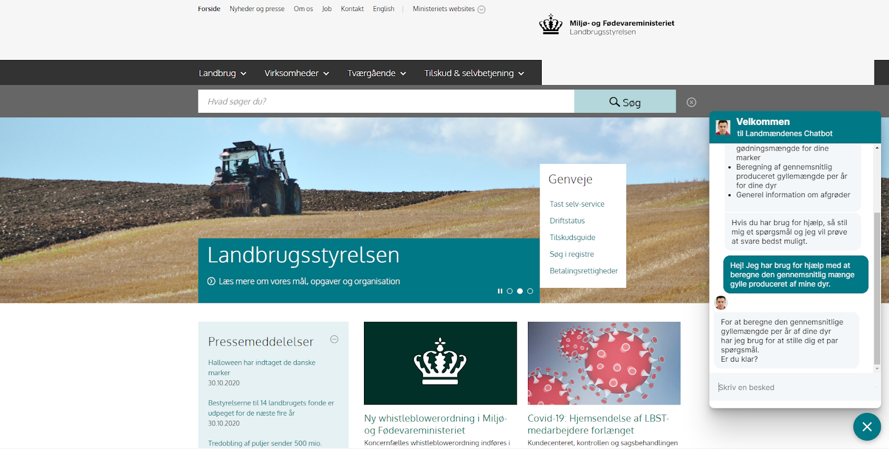

# CrossDit_Chatbot

This project consists of a Homepage and a Rasa-powered chatbot and aims to educate and support danish
farmers in regards to mandatory manure registration and best practices in terms of fertilizers in general.
Furthermore, the project also seeks to motivate farmers to follow the laws for yearly use of manure by educating about the
environmental consequences of over-manuring fields. This project was part of the course "Cross Disciplinary Teamwork" at the IT University of Copenhagen, and was done in collaboration with Landbrugsstyrelsen.dk.  

  
In order to make the Chatbot work, one needs to install RASA
and run the following command in the RASA cmdline:
rasa run -m models --enable-api --cors "*" --debug
